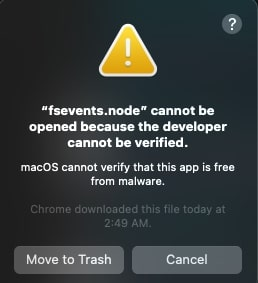
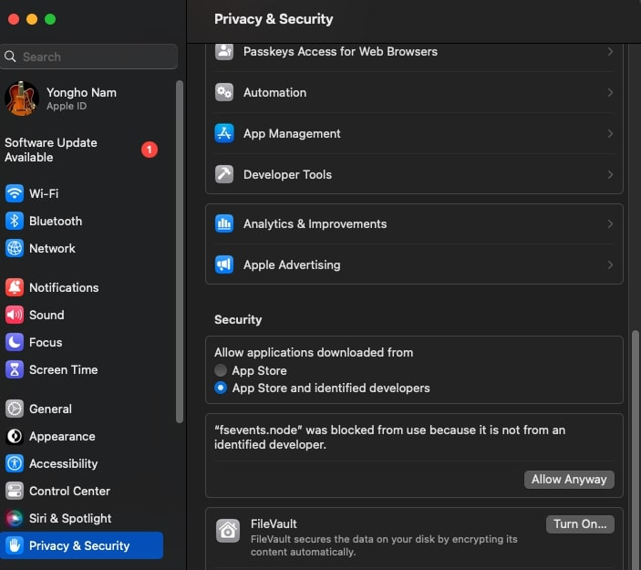

# Can It Run
Wondering if your computer can handle the latest games? 'Can It Run' has you covered! We leverage the OpenAI API to analyze your computer's performance against game requirements


## Concepts that you need to work on this project

 - [Docker, Dockerfile, Docker-Compose.yml](https://docs.docker.com/)
 - [Express.js](https://expressjs.com/)
 - [typescript](https://www.youtube.com/watch?v=30LWjhZzg50)
  - [MVC model](https://www.youtube.com/watch?v=DUg2SWWK18I)
 

## For Developers

Here are the steps to work on this porject.

- install docker
- open terminal
- move to the work directory where "docker-compose.yml" file is in
- run this command on your terminal
    ```bash
    docker-compose up
    ```
    it will start the docker and you will see database server is running on docker GUI tool, 
- open another terminal and run this command on your terminal
    ```
    npm run dev
    ```
    it will run the backend server on localhost:3000

you may see something like this:

but don't worry just go to system setting and select "open it anyway"



when the backend server starts, it will initialize the databse for you.

Congrats! you are all set and now can write your code.

## How It Works
user can type their computer's specs or not, if they typed the specs, it will suggest CPU or GPU models that has simmilar name then user will select one of them.

- if the user types their computer's specs: 
    - it will use OpenAI API to compare user's CPU and GPU models to game's minimum and maximum requirements.

    - it will send a message something like this: "hi gpt, i will send you my CPU and GPU models, RAM and Game's minimum and recomanded requirements. You will compare them and then tell me wether I can run that game or not, You must have to ansewr in Yes, No. if this game or cpu and gpu mode names are new to you, guess it's performance by it's name since higher number represents newer model or higher core and thread numbers. {cpu model}, {gpu model"} {Game's minimum and recomanded requirements}.
    - after we get the answer from OpenAI, we will save that answer on our database too
        - the GameInfo table has four columns: "lowest_possible_cpu", "highest_impossible_cpu", "lowest_possible_gpu" and "highest_impossible_gpu" which means :
        lowest_possible = cpu and gpu models that has lowest benchmark ranking to run the game, highest_possible = cpu and gpu models that has highest benchmark ranking to run the game.
        - we are going to compare user's specs with these values first and then use OpendAI
        - it is necessary to reduce the usage of OpenAI API (it's expensive)

- if the user DIDN'T types their computer's specs
    - it will just simply show the gmae's minimum and maximum requirements.